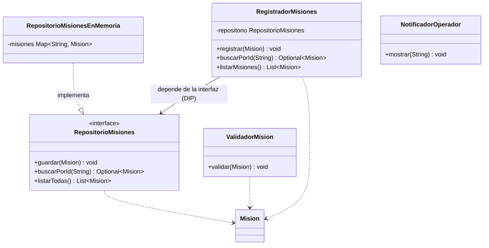

# Diagrama de clases - Reto 04 (SRP y DIP)

- **SRP:** cada clase tiene una sola razon para cambiar (registrar, validar, notificar).
- **DIP:** `RegistradorMisiones` recibe un `RepositorioMisiones` por constructor y no conoce la implementacion concreta.